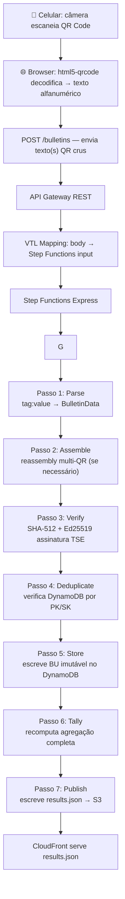

## Visão do Fluxo Completo



## Detalhes de Cada Passo

### Passo 1 — Parse

Converte o texto bruto do QR (formato `TAG:valor`) na estrutura `BulletinData`:

```python
# Exemplo de input QR
"PROC:0000\x1CPLEI:0001\x1CTURN:1\x1CUNFE:SP\x1CMUNI:71072..."

# Output: BulletinData
{
  "proc": "0000",
  "plei": "0001",
  "turn": 1,
  "unfe": "SP",
  "muni": "71072",
  ...
}
```

### Passo 2 — Assemble

Boletins com muitos votos podem ser divididos em até 4 QR codes. Este passo:
- Se `total == 1`: passa direto
- Se `total > 1`: armazena fragmento em `partial_qrcodes` (TTL 1h) e aguarda os demais

### Passo 3 — Verify

Verifica a integridade do BU:
1. **SHA-512**: hash do conteúdo deve bater com o campo `HASH` do QR
2. **Ed25519**: assinatura deve ser válida com a chave pública do TSE

### Passo 4 — Deduplicate

Consulta DynamoDB com a chave composta:
- **PK**: `{PROC}#{PLEI}#{TURN}`
- **SK**: `{UNFE}#{MUNI}#{ZONA}#{SECA}`

Se já existe → descarta (impede replay attacks). Se existe com assinatura diferente → flagra para revisão manual.

### Passo 5 — Store

Insert com `ConditionExpression: attribute_not_exists(pk)` — garante imutabilidade mesmo em condições de race.

### Passo 6 — Tally

Faz scan da tabela `bulletins` para a eleição atual e recomputa os totalizadores agregados por candidato.

### Passo 7 — Publish

Serializa os resultados em `results.json` e faz `s3:PutObject`. O CloudFront serve o arquivo com cache desabilitado para resultados sempre frescos.
