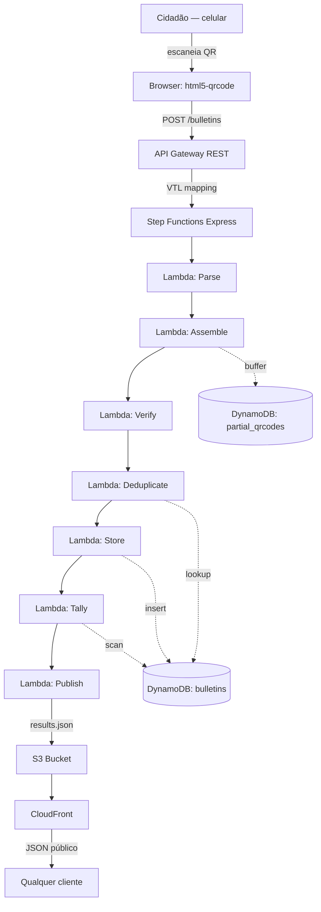

Sistema serverless de contagem paralela de votos baseado nos dados QR Code do Boletim de Urna (BU) das urnas eletrônicas brasileiras.

## Stack

| Camada | Tecnologia | Justificativa |
|--------|-----------|---------------|
| Frontend | Next.js / Vercel | Acesso à câmera via `html5-qrcode`, SSR, hospedagem gratuita |
| API Ingest | API Gateway REST + VTL | Zero Lambda no caminho de ingestão, integração direta com Step Functions |
| Orquestração | Step Functions Express | Retry por passo, observabilidade no console AWS |
| Processamento | Lambda (Python 3.11) | Funções individuais: parse, assemble, verify, deduplicate, store, tally, publish |
| Banco de dados | DynamoDB | Serverless, free tier permanente (25 GB), key-value ideal para lookup de BU |
| Armazenamento | S3 | JSON de resultados estático |
| CDN | CloudFront | Serving público dos resultados |
| IaC | AWS SAM | Infraestrutura como código |
| Criptografia | PyNaCl (libsodium) | Verificação de assinatura Ed25519 |
| Hash | hashlib (stdlib) | SHA-512 |

## Diagrama de Componentes

## Princípios de Design

- **Zero Lambda no caminho crítico de ingestão**: a API Gateway usa VTL para montar o input do Step Functions diretamente, sem overhead de Lambda adicional
- **Imutabilidade**: BUs são insert-only via `ConditionExpression: attribute_not_exists(pk)`
- **Verificação criptográfica obrigatória**: nenhum BU é armazenado sem passar pela verificação SHA-512 + Ed25519 do TSE
- **Auditabilidade**: o `raw_text` do QR code é armazenado integralmente para auditoria independente
